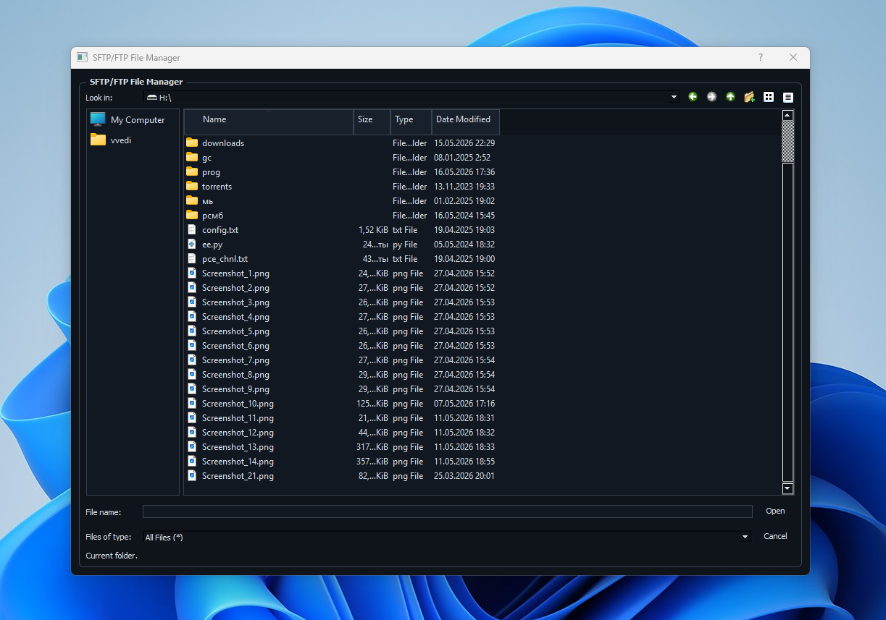

# SFTP/FTP File Manager

GUI-клиент и отдельный LocalServer для тестовой работы с файлами через WSL.

## Как запустить собранную версию

1. Запустить сервер:
   `dist\LocalServer.exe`

2. Запустить интерфейс:
   `dist\FileManager.exe`

LocalServer слушает `http://127.0.0.1:5000/api`.
Swagger доступен по `http://127.0.0.1:5000/docs/`.

## Сборка

Запустить один файл:

`build_exe.bat`

Он собирает обе части:

- `dist\FileManager.exe`
- `dist\LocalServer.exe`

## Что сейчас работает

- просмотр папок и файлов WSL;
- переход по папкам;
- обновление списка раз в 5 секунд;
- создание папки;
- переименование;
- удаление;
- copy/move внутри удаленной файловой системы;
- upload файла из Windows в текущую папку;
- download выбранного файла в папку Windows;
- базовые connection endpoints без реального подключения.

## Известные ограничения

- сначала нужно запускать LocalServer, потом GUI;
- настоящий SFTP/FTP пока не подключен;
- connection manager пока заглушка;
- WSL должен быть установлен и настроен как default distro.
